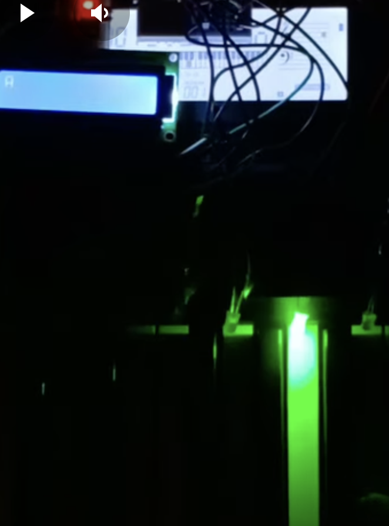

# Arduino MIDI Piano Light Sync

An Arduino-based project that synchronizes LED lights with each piano note played on an external MIDI-supported piano. The project uses MIDI services to detect the keys played on the piano and glows the corresponding lights in sync.

## Features

- **MIDI Integration:** Connects to a MIDI-supported piano to receive information about the notes played.
- **LED Synchronization:** Lights up LEDs corresponding to the notes played, creating a visual representation of the music.
- **Real-Time Response:** Minimal latency ensures lights respond instantly to the notes played.

## Components Used

- Arduino (e.g., Arduino Uno)
- LED Strip or individual LEDs
- MIDI interface (e.g., MIDI shield or USB MIDI adapter)
- Resistors, wires, and breadboard

## How It Works

1. The Arduino receives MIDI signals from the piano.
2. It processes the MIDI data to identify the specific note played.
3. Corresponding LEDs are triggered to light up in sync with the notes.

## Installation

1. Clone the repository:
   ```bash
   git clone https://github.com/your-username/arduino-midi-piano-light-sync.git

## Check out the [demo video](https://www.youtube.com/watch?v=your-demo-video-link)!




